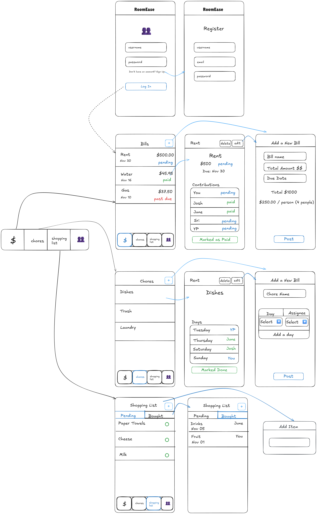
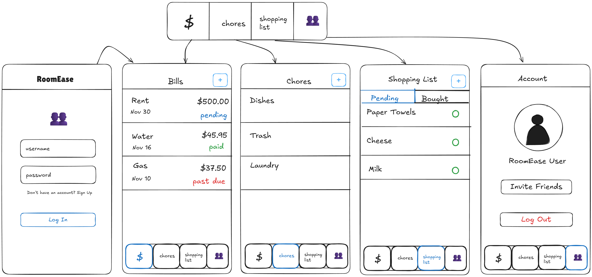
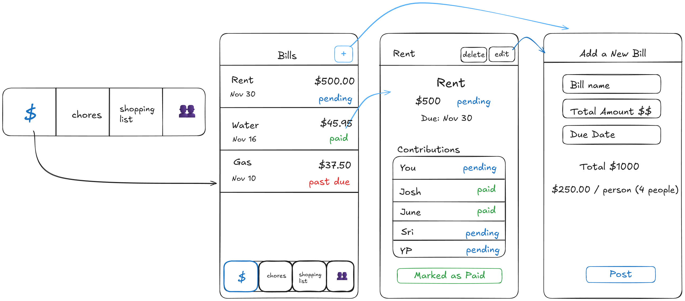
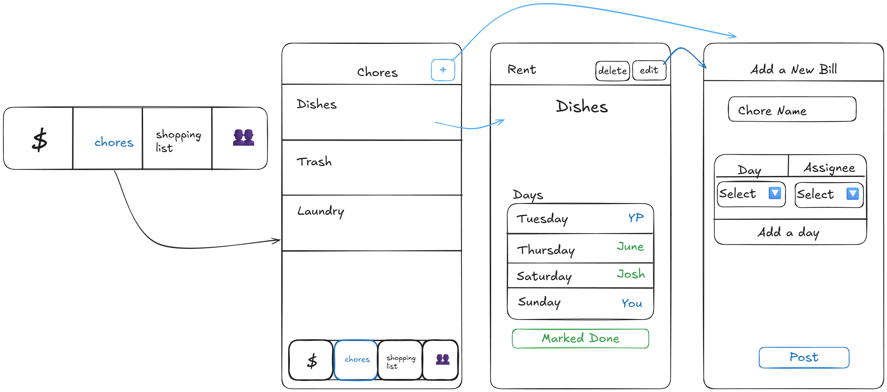
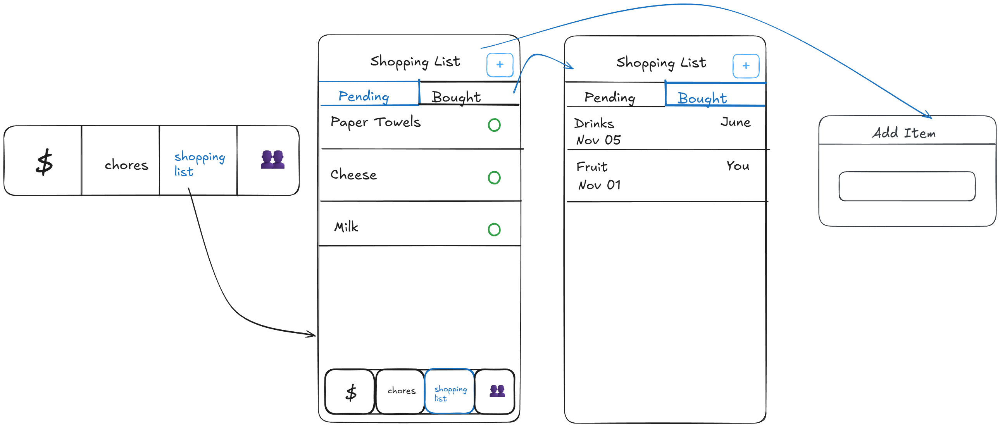
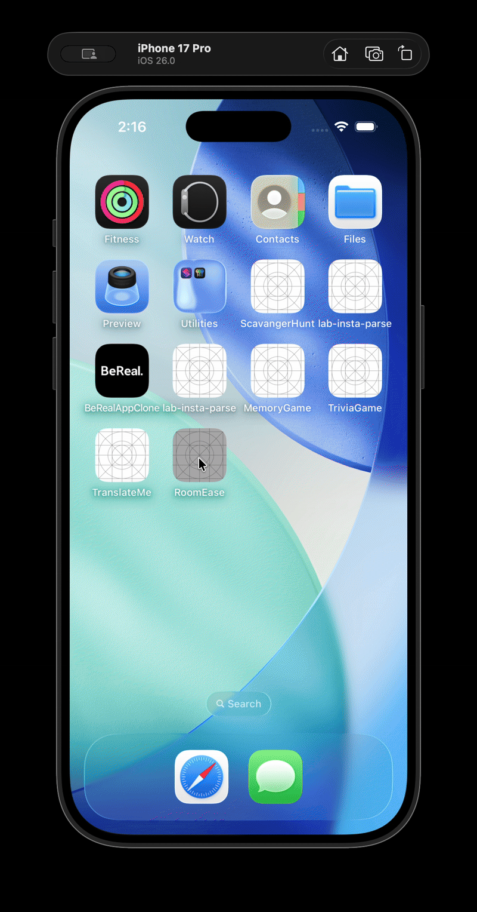
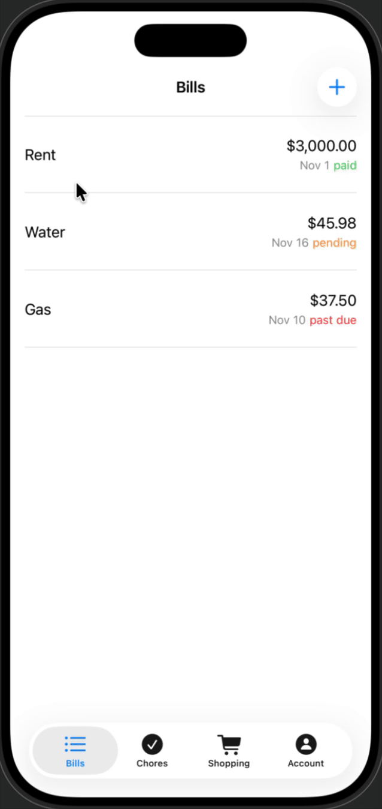

Original App Design Project
===

# RoomEase

## Table of Contents

1. [Overview](#Overview)
2. [Product Spec](#Product-Spec)
3. [Wireframes](#Wireframes)
4. [Schema](#Schema)
5. [Builds](#Builds)

## Overview

### Description

Shared living management app for roommates. Split bills, track chores, and manages shopping lists in one convinient place. Keep the communication transparent and responsibilities clear, while reducing conflicts over money and cleaning.

### App Evaluation

- **Category:** Productivity / Lifestyle
- **Mobile:** Mobile is essential for roomates to instantly log expenses and mark chores. While app will continue to remind roomates about any tasks and unpaid bills.
- **Story:** “Keep your home organized and your roommates happy.” The app is designed to turn shared living space from disaster to a pleasant experience with clear boarders and collaboration. We simplify communication, tasks and responsibilities. 
- **Market:** Weekly use for majority of the users. During important events i.e Parties, birthdays, friends&family visitations the could be used daily in preparation.
- **Habit:** College students, young adults in shared housing
- **Scope:** V1 split bills and shared expenses. V2 Add and share chores. V3 Shared shopping list. V4. Reminders.

## Product Spec

### 1. User Stories (Required and Optional)

**Required Must-have Stories**

* User can register an account and log in.
* User can create or join a "Home" group with roommates via an invite code.
* User can view a dashboard summarizing upcoming bills and chores.
* User can add a new shared bill with a total amount and due date.
* User can view a list of all active and past bills and their status (paid/pending).
* User can see a bill's details, including the full amount and each roommate's share.
* User can mark their portion of a bill as paid.
* User can create a new chore.
* User can view a list of all shared chores.
* User can assign a chore to a roommate or set it to "unassigned."
* User can mark a chore as completed.
* User can add an item to a shared shopping list.
* User can view all items on the shopping list.
* User can mark a shopping list item as purchased.

**Optional Nice-to-have Stories**

* User can receive push notifications for an upcoming bill due date.
* User can receive a push notification reminder for an assigned chore.
* User can set up recurring bills (e.g., Rent, monthly) and chores (e.g., Trash, weekly).
* User can split a bill unevenly by percentage or specific amounts.
* User can add a photo a receipt to a bill or expense.
* User can see a summary of who owes whom to simplify payments.
* User can view a history of completed chores and by whom.
* User can view a calendar of chore assignments.
* User can comment on a bill or chore.
* User can view a list of shared upcoming and past events.
* User can add a new event with a title, description, date, and time.
* User can see the details of a specific event.
* User can set up recurring events (e.g., weekly "Game Night").
* User can receive a push notification reminder before an event starts.
* User can RSVP to an event (e.g., Going, Not Going).
* User can see who is attending an event.

### 2. Screen Archetypes

-   [ ] **Login Screen**
    * User can enter email and password to log in.
    * User can navigate to the Registration Screen.
    * (Optional: User can reset their password).

-   [ ] **Registration Screen**
    * User can create a new account (e.g., name, email, password).
    * User can navigate back to the Login Screen.

-   [ ] **(Optional) Create/Join Home Screen**
    * After registering, the user is prompted to create a new "Home" group or enter an invite code to join one.

-   [ ] **Dashboard Screen**
    * User can see a summary of upcoming bills.
    * User can see a summary of "Today's" or "Upcoming" chores.
    * User can see a "who owes whom" balance summary.

-   [ ] **Bills List Screen**
    * User can view all shared bills with amount and status (paid / pending / past due).
    * User can tap "Add" to go to the Add Bill Screen.
    * User can tap a bill to see its details.

-   [ ] **Bill Details Screen**
    * User can view details for a single bill: total amount, due date, and remaining balance.
    * User can see each roommate’s share and payment status.
    * User can tap a button to mark their share as paid.

-   [ ] **Add Bill Screen**
    * User can enter a bill name, total amount, and due date.
    * User can select how to split the bill (e.g., equally, by amount).
    * User can tap **Post** to add the bill to the group.

-   [ ] **Chores List Screen**
    * User can see a list of shared chores (Trash, Dishes, Laundry, etc.).
    * User can see who is assigned to each chore and its due date/day.
    * User can mark a chore as complete.
    * User can tap "Add" to go to the Add Chore Screen.

-   [ ] **Chore Calendar Screen**
    * User can view a calendar showing scheduled/assigned chores for each day.

-   [ ] **Add Chore Screen**
    * User can enter a chore name.
    * User can assign the chore to a roommate.
    * User can set a due date or make it a recurring chore.

-   [ ] **Shopping List Screen**
    * User can see a list of shared items needed.
    * User can add a new item to the list.
    * User can mark an item as purchased.

-   [ ] **(Optional) Events List Screen**
    * User can see a list of upcoming shared events (e.g., Party, Game Night).
    * User can see the date and time for each event.
    * User can tap "Add" to go to the Add Event Screen.
    * User can tap an event to see its details.

-   [ ] **(Optional) Event Details Screen**
    * User can view the event title, description, date, and time.
    * (Optional: User can see who has RSVP'd).

-   [ ] **(Optional) Add Event Screen**
    * User can enter an event title and description.
    * User can select a date and time for the event.
    * User can tap **Save** to add the event to the group.

### 3. Navigation

**Tab Navigation** (Tab to Screen)

-   [ ] **Bills** (Leads to Bills List Screen)
-   [ ] **Chores** (Leads to Chores List Screen)
-   [ ] **Shopping** (Leads to Shopping List Screen)
-   [ ] **Settings** (Leads to user profile, group management, notifications)

**Flow Navigation** (Screen to Screen)

-   [ ] **Bills List Screen**
    * Leads to Bill Details Screen (when tapping an existing bill)
    * Leads to Add Bill Screen (when tapping "Add" button)
-   [ ] **Bill Details Screen**
    * Leads to Bills List Screen (on back navigation)
-   [ ] **Add Bill Screen**
    * Leads to Bills List Screen (after successful post)
-   [ ] **Chores List Screen**
    * Leads to Add Chore Screen (when tapping "Add" button)
    * Leads to Chore Calendar Screen (when tapping calendar icon/button)
-   [ ] **Add Chore Screen**
    * Leads to Chores List Screen (after successful post)
-   [ ] **Shopping List Screen**
    * Leads to Purchased Items
-   [ ] **(Optional) Events List Screen**
    * Leads to Event Details Screen (when tapping an existing event)
    * Leads to Add Event Screen (when tapping "Add" button)
-   [ ] **(Optional) Add Event Screen**
    * Leads to Events List Screen (after successful save)
-   [ ] **(Optional) Event Details Screen**
    * Leads to Events List Screen (on back navigation)

## Wireframes

## Schema 

### Models

#### User

| Property | Type | Description |
|---|---|---|
| username | String | Unique identifier for the user (default Parse field). |
| password | String | User's password for login authentication (default Parse field). |
| email | String | User's email address. |

#### Home (Optional)

| Property | Type | Description |
|---|---|---|
| name | String | Name of the shared home (e.g., "The Apartment," "21B"). |
| inviteCode | String | Unique code for roommates to join this home. |
| users | Array of Pointers to User | List of users belonging to this home. |

#### Bill

| Property | Type | Description |
|---|---|---|
| name | String | Name of the bill. |
| totalAmount | Number | Total amount of the bill. |
| dueDate | Date | When the bill is due. |
| isPaid | Boolean | Overall status of the bill (true if all shares are paid). |
| creator | Pointer to User | The user who created this bill. |
| home | Pointer to Home | The home this bill belongs to. |
| shares | Array of Objects | Each object contains { userPointer: Pointer to User, amount: Number, isPaid: Boolean }. |
| notes | String | Optional notes for the bill. |

#### Chore

| Property | Type | Description |
|---|---|---|
| name | String | Name of the chore. |
| assignedTo | Pointer to User | The user currently assigned to the chore (can be null for unassigned). |
| dueDate | Date | When the chore is due. |
| isCompleted | Boolean | True if the chore has been marked as completed. |
| recurrencePattern | String | e.g., "daily," "weekly," "monthly," "Mon, Wed, Fri". |
| home | Pointer to Home | The home this chore belongs to. |
| creator | Pointer to User | The user who created this chore. |

#### ShoppingListItem

| Property | Type | Description |
|---|---|---|
| name | String | Name of the item (e.g., "Milk," "Paper Towels"). |
| isPurchased | Boolean | True if the item has been purchased. |
| addedBy | Pointer to User | The user who added the item to the list. |
| home | Pointer to Home | The home this item belongs to. |        

### Builds

##### Previous Build

### Networking
